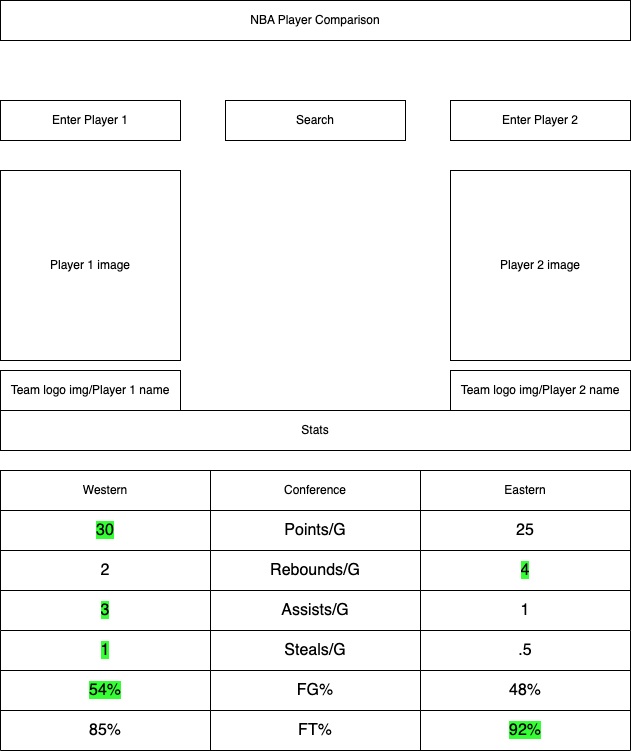
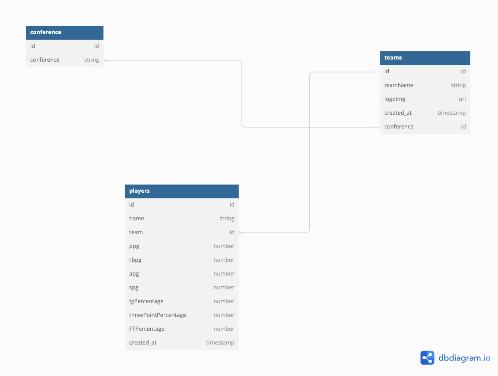

# nba-player-comparison-app

The purpose of this website is to look up your favorite players and compare their stats so you can win any sports arguments with anyone!

 
 

I will begin by getting the database setup, and all of the seeders. The seeders will take the most amount of time, as there are 30 teams. I will include the 5 starting players for every team.

After I get the dataBase set up, that is when I will start working on my front end work and pulling from my back end.

# Technologies Used

Node.js, JavaScript, HTML, CSS, MongoDB, Axios

# Getting Started
https://nba-player-comparison.surge.sh/
 
While the app is deployed and displays the front end, the express server is not deployed, and has to be running from my local computer at the moment to get any functionality

# Landing Page

# Functionality

# Next Steps
The list of things I would like to continue adding include
- More seeders
- More statistic's categories
- Functionality to have an autofill/ lowercase and upper case queries
- Better mobile functionality
